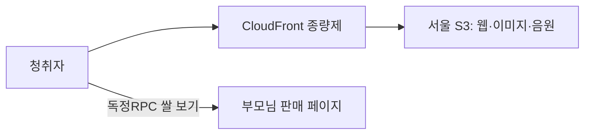

# 무료 오디오북 서비스 고도화 작업계획서

- 작성일: 2026-10-08
- 대상 프로젝트: autobio-audiobook
- 목표: 월 활성 청취자 1,000명과 독정RPC 쌀 구매 페이지 유입
- 운영 방식: 오디오북 무료 공개, 부모님이 운영하는 판매 채널로 구매 연결
- 기본 구성: 현재 VitePress·Vue + AWS 서울 S3 + CloudFront 종량제
- 상태: 계획 수립. 아래 구현·클라우드 구성·운영 전환은 아직 수행하지 않음

## 1. 목표와 작업 범위

방문자는 로그인 없이 글을 읽고 오디오북을 듣는다. 재생 위치와 설정은 현재처럼 브라우저에 저장한다. 독정RPC에 관심이 생기면 구매 링크를 통해 부모님이 관리하는 외부 판매 페이지로 이동한다.

이번 작업의 중심은 상용 목적에 맞는 호스팅 이전, 휴대폰 재생 품질, 구매 연결, 최소한의 성과 측정이다. 회원·구독·오디오북 결제·주문 관리·고객 원고 생성 기능은 이번 범위에 포함하지 않는다. 기존 Firebase 반응 기능은 선택적으로 유지하며, 새 API나 DB는 추가하지 않는다.

### 성공 기준

| 구분 | 기준 |
| --- | --- |
| 이용 | 계측 기준 월 활성 청취자 1,000명 목표 |
| 청취 | 공개한 회차의 음원·문장 표시·이어듣기·다음 화 연결 정상 동작 |
| 구매 연결 | 홈 하단, 23화 끝, 마지막 외전 청취 완료 화면에서 실제 판매 페이지 연결 |
| 비용 | 초기 호스팅 예산 월 $1~3. 사용량을 계측해 관리 |
| 운영 | 자동 배포, 배포 전 검증, 이전 버전 복구 절차 확보 |
| 성과 | 청취 시작·완료, 구매 카드 노출·클릭, 판매 채널 유입을 확인 |

사용자 수는 로그인 없는 환경의 기기·브라우저 기준 추정치다. 월 활성 청취자는 해당 월에 실제 재생 시작이 확인된 사용자로 정의한다. 페이지 방문자 수와 구분한다. 클릭률과 구매 전환율은 첫 달에 기준값을 수집한 뒤 목표를 정한다.

## 2. 현재 상태와 적용 원칙

| 현재 상태 | 작업에 반영할 사항 |
| --- | --- |
| VitePress 정적 빌드 + GitHub Pages 배포 | 프런트엔드 유지, 배포 대상을 S3·CloudFront로 변경 |
| 읽기 순서 26편, 낭독 준비 4편: prolog·ep01·ep02·ep03 | 4편 베타와 전체 낭독 공개를 구분 |
| 낭독 MP3 160kbps·스테레오 | 초기 음질 유지. 실제 사용량 증가 시 96kbps 비교 청취 |
| 재생·읽기 기록은 localStorage | 별도 서버 저장 없이 유지. 도메인 변경 시 기록이 자동 이전되지 않음을 안내 |
| 문장 하이라이트·자동 다음 화·Media Session·재시도 구현 | 기존 기능을 보존하고 새 호스팅과 실기기에서 검증 |
| Firebase 반응 기능 존재, README에는 운영 설정 미연결로 기록 | 실제 설정을 확인한 뒤 유지 여부 결정 |
| 구매 카드는 제안서에만 있고 구현되지 않음 | 실제 구매 URL과 최신 운영 조건을 기준으로 신규 구현 |
| 배포 CI에 단위·빌드·공유·타입 검사 존재 | 구매 연결과 재생 회귀 검증 추가. 반응 기능 운영 시 규칙 검사 연결 |

기존 [독정RPC 구매 경로 제안서](web/docs/독정RPC_쌀_구매_경로_제안서.md)는 배치와 디자인 참고자료로만 사용한다. 제휴 수익·수익 배분·수수료 관련 가정은 이번 계획에 승계하지 않는다. 가족 관계와 실제 대가 여부에 맞는 문구만 사용한다.

## 3. 운영 구조와 비용



웹·음원은 로그인 없이 공개한다. S3 버킷 자체는 비공개로 두고 CloudFront OAC를 통해 제공한다. 이는 원본 저장소 접근을 제한하는 설정이며, 청취자에게 구매 권한이나 서명 URL을 요구하는 구조가 아니다. [AWS OAC 공식 안내](https://docs.aws.amazon.com/AmazonCloudFront/latest/DeveloperGuide/private-content-restricting-access-to-s3.html)

CloudFront는 종량제로 시작한다. 한국이 포함된 Price Class 200 또는 All을 선택하고 국내 통신망에서 재생 결과를 확인한다. [Price Class 지역 범위](https://docs.aws.amazon.com/cdk/api/v2/python/aws_cdk.aws_cloudfront/PriceClass.html)

### 비용 계산의 기준

현재 낭독 160kbps는 청취 1시간당 약 72MB다. 아래 수치는 음원 본체만 계산한 십진 단위이며 이미지·별도 BGM·헤더·재시도·선행 다운로드를 제외한다.

| 월 청취자 | 1인당 월 청취시간 | 월 음원 전송량 |
| --- | --- | --- |
| 1,000명 | 1시간 | 약 72GB |
| 1,000명 | 5시간 | 약 360GB |
| 1,000명 | 10시간 | 약 720GB |

2026-10-08 확인 기준 CloudFront 종량제는 월 전송 1TB와 HTTP/HTTPS 요청 1,000만 건의 무료 사용량을 제공한다. 무료 사용량은 다른 배포와 같은 계정·조직에서 공유될 수 있으므로 합산 사용량을 확인한다. S3에서 CloudFront로 보내는 AWS 원본 전송은 무료다. [AWS 공식 FAQ](https://aws.amazon.com/cloudfront/faqs/)

서울 S3 Standard 저장 1GB와 월 GET 100만 회를 가정하면 저장·GET 합계는 약 $0.38/월이다. 초기 호스팅 예산 월 $1~3은 운영용 예산이며 확정 청구액이나 비용 상한이 아니다. 도메인·DNS·업로드·로그·백업·세금·TTS 제작비는 별도로 관리한다. [AWS 서울 S3 공식 가격 데이터](https://pricing.us-east-1.amazonaws.com/offers/v1.0/aws/AmazonS3/current/ap-northeast-2/index.json)

월 전송량 500GB·800GB와 월 비용 $3·$5를 초기 알림 기준으로 제안한다. 실제 계정의 남은 무료 사용량에 맞춰 조정한다. 예산 알림은 자동 과금 차단 장치가 아니므로 전송량도 함께 확인한다. [AWS Budgets 안내](https://aws.amazon.com/aws-cost-management/aws-budgets/faqs/), [알림과 실제 비용의 차이](https://docs.aws.amazon.com/cost-management/latest/userguide/budgets-managing-costs.html)

전송·요청량이 증가하면 예상 종량제 비용과 보안 기능 비용을 합산해 CloudFront Pro 전환을 검토한다. 현재 Pro는 분배당 월 $15, 전송 50TB·요청 1,000만 건을 포함하지만 지속적인 허용량 초과 시 성능 조정이 가능하다. [정액제 가격](https://aws.amazon.com/cloudfront/pricing/), [기능·허용량 조건](https://docs.aws.amazon.com/AmazonCloudFront/latest/DeveloperGuide/flat-rate-pricing-plan.html)

## 4. 착수 전에 확정할 입력값

- [ ] 부모님이 실제 관리하는 상품 또는 판매점의 HTTPS 구매 URL
- [ ] 판매 페이지의 판매자·품목·휴대폰 구매 가능 여부 확인
- [ ] 운영 도메인 또는 기존 도메인의 서브도메인
- [ ] 사용할 AWS 계정과 기존 CloudFront 무료 사용량 소비 현황
- [ ] 최초 공개 범위: 현재 낭독 4편 베타 또는 추가 회차를 준비한 공개
- [ ] Firebase 반응 기능 운영 여부와 현재 배포 설정
- [ ] GA4 속성·측정 ID와 수집 항목·개인정보 안내 방식
- [ ] 공개할 원고·음성·음악·이미지의 사용 조건 확인

기존 제안서의 네이버·쿠팡 설정은 예시 주소다. 조사 출처에 있는 상품 URL도 부모님이 관리하는 판매 페이지로 확인되기 전에는 사용하지 않는다.

입력값이 없는 단계에서는 구매 카드의 구조와 테스트를 먼저 준비할 수 있다. 운영 빌드에서는 예시 구매 주소가 공개되지 않도록 검증한다.

## 5. 단계별 작업

아래 일정은 1인 개발 기준 초안이다. 입력값이 준비된 뒤 사이트·이전 작업에 약 4~6일을 배정하고, 추가 22편 제작과 사람 검수 시간은 별도로 잡는다. AWS 리소스 구성과 콘텐츠 준비는 독립적으로 진행할 수 있다.

### 단계 A — 범위·주소·성과 측정 설계

| ID | 작업 | 산출물·완료 조건 |
| --- | --- | --- |
| A-01 | 구매 URL·운영 도메인·공개 회차 확정 | 구매 페이지 판매자 확인, 실제 링크와 공개 회차 목록 기록 |
| A-02 | 주소 설정 정리 | 운영 origin과 base를 환경 설정으로 지정. 기본 제안은 전용 도메인 루트 / |
| A-03 | 구매 카드 문구·배치 확정 | 가족 관계 안내, 외부 이동 표시, 세 노출 위치 정의 |
| A-04 | 이벤트 정의 | 청취 시작·완료, 카드 노출·클릭의 발생 조건과 중복 방지 기준 기록 |

기존 회차의 /read/ep01.html 같은 상대 경로와 회차 ID는 보존한다. 기존 GitHub Pages URL을 공유받은 사용자를 위한 새 주소 안내·이동 방안도 마련한다. GitHub Pages의 상업적 거래 촉진 목적 이용 제한을 고려해 운영 호스팅을 이전한다. [GitHub Pages 공식 제한](https://docs.github.com/en/pages/getting-started-with-github-pages/github-pages-limits)

### 단계 B — 구매 연결과 계측 구현

| ID | 작업 | 산출물·완료 조건 |
| --- | --- | --- |
| B-01 | 구매 설정을 한 파일로 관리 | 실제 URL·문구·노출 위치를 content/afterword.json 등에 정의 |
| B-02 | 재사용 구매 카드 구현 | 현재 글꼴·색상·간격을 활용한 작은 카드와 외부 링크 |
| B-03 | 홈 하단에 구매 진입점 추가 | 작품 소개·목차 뒤에서 독정RPC를 확인하고 구매 페이지로 이동 |
| B-04 | 23화 본문 끝에 카드 추가 | 기존 회차 이동 버튼 아래 배치 |
| B-05 | 마지막 외전 완청 화면 연결 | side 음원 준비 후 검증. 현재 3화의 준비 안내와 구분 |
| B-06 | 분석 이벤트 연결 | 스테이징에서 이벤트 발생·값·중복 여부 확인 |

예시 문구:

> 할아버지의 이야기는 오늘의 독정RPC로 이어집니다.  
> 이 서재를 만든 사람의 부모님이 운영하는 독정RPC의 쌀을 소개합니다.  
> **독정RPC 쌀 보기 ↗**  
> 외부 판매 페이지로 이동합니다.

구매 카드는 일반 문서 흐름에 배치한다. 기존 자동재생을 유지하고, 재생기·다음 화 버튼을 가리지 않는다. 가격·생산연도·품종은 판매 페이지에서 확인하도록 한다. 새 탭 이동을 기본안으로 두되 휴대폰·인앱 브라우저에서 돌아왔을 때 재생 상태를 검증한다.

GA4의 외부 링크 클릭 기능을 활용하고 청취·카드 노출에는 별도 이벤트를 추가한다. 외부 클릭과 사용자 정의 클릭을 동시에 집계해 중복 수치가 생기지 않도록 이벤트 기준을 통일한다. [GA4 공식 외부 클릭 측정](https://support.google.com/analytics/answer/9216061?hl=en)

| 이벤트 | 발생 기준 |
| --- | --- |
| audio_start | 사용자 재생 요청 후 실제 playing 확인. timeupdate마다 전송하지 않음 |
| episode_complete | 실제 해당 회차 음원 종료. 중간 탐색만으로 완청 처리하지 않음 |
| work_complete | 마지막 외전이 준비된 상태에서 실제 음원 종료 |
| rice_card_view | 카드가 정의한 화면 노출 조건을 충족했을 때 페이지·위치별 1회 |
| rice_link_click | 구매 링크 클릭. 홈·23화·외전 위치 구분 |

회차 ID·노출 위치 등 필요한 값만 전송한다. 이름·연락처·원고 내용은 이벤트에 넣지 않는다. 분석 실패가 재생과 링크 이동을 막지 않게 한다. 구매 완료는 판매 채널의 보고서와 대조하고, 외부 링크 클릭을 주문으로 해석하지 않는다.

### 단계 C — AWS와 자동 배포 구성

| ID | 작업 | 산출물·완료 조건 |
| --- | --- | --- |
| C-01 | 서울 S3·CloudFront 종량제 구성 | OAC 원본 접근, 공개 CloudFront 청취, HTTPS, 기본 문서·404 확인 |
| C-02 | 캐시 정책 설정 | HTML은 짧은 캐시, 해시 자산은 긴 캐시. 음원 교체 절차 기록 |
| C-03 | GitHub Actions 배포 변경 | 기존 검증 유지, OIDC·최소 권한으로 운영 배포 |
| C-04 | 스테이징 업로드·확인 | MP3·이미지·웹의 실제 경로와 Range 재생 확인 |
| C-05 | 도메인·공유 정보 반영 | canonical·OG·공유 이미지·아이콘·manifest 주소 확인 |
| C-06 | 사용량 알림·복구 구성 | 비용·전송 알림, 이전 버전 재배포 절차 확인 |

기본안은 하나의 CloudFront 배포와 동일 사이트 origin으로 웹·음원을 제공한다. 별도 미디어 도메인 도입은 필요가 확인된 뒤 판단한다.

현재 음원 빌드는 로컬 MP3·SRT 쌍을 검증하므로 이 검증을 유지한다. 배포 시 음원과 이미지 업로드·접근 확인을 먼저 완료하고 HTML·카탈로그를 공개한다. 아직 올리지 않은 음원을 카탈로그에 노출하지 않는다.

현재 MP3는 회차 ID 파일명이므로 변경 시 이전 음원이 캐시에 남을 수 있다. 초기에는 기존 경로를 유지하고 교체 파일 무효화 절차를 정한다. 해시가 있는 파일은 변경 시 새 이름으로 배포한다. 이전 HTML이 참조하는 해시 자산을 즉시 삭제하지 않는다.

원고·MP3·SRT·웹 산출물의 버전 또는 해시를 릴리스 기록에 남긴다. 같은 버전으로 복구할 수 있게 이전 산출물과 음원을 보존한다. 비용을 줄이기 위해 불필요한 전체 파일 무효화와 과도한 상세 로그를 피한다.

### 단계 D — 검증과 운영 전환

- [ ] 홈과 모든 공개 회차·기존 회차 주소가 새 도메인에서 열림
- [ ] canonical·OG URL·공유 이미지·아이콘·manifest가 운영 주소와 일치
- [ ] 존재하지 않는 경로에서 정상적인 404 동작 확인
- [ ] 각 공개 음원의 길이·문장 시각·원고 버전 일치 확인
- [ ] 중간 탐색에서 HTTP Range·206 응답과 재생 확인
- [ ] 재생 위치·속도·완독 기록 복원 확인
- [ ] 낭독 중 BGM 중복 재생 없음
- [ ] 회차 자동 연결·음원 미준비 안내·최종 완청 안내 구분
- [ ] 세 구매 위치가 재생기와 겹치지 않고 실제 판매 페이지에 연결
- [ ] 구매 페이지 이동 후 돌아와 청취를 이어갈 수 있음
- [ ] 분석 이벤트·오류 상황이 재생과 구매 링크를 막지 않음
- [ ] Firebase 운영 시 반응 저장·규칙·새 origin의 익명 상태 확인
- [ ] 이전 웹·음원 산출물 재배포와 도메인 복구 절차 확인

기존 자동 검증을 실행하고 구매 연결·도메인 설정·재생 흐름의 필요한 회귀 검사를 추가한다.

```sh
cd web
npm ci
npm test
npm run typecheck
npm run build
npm run test:sharing
npm run test:e2e
```

새 검증에서 운영 base 경로와 origin을 명시한다. 현재 Playwright 설정은 기존 /bae-memoir/ 주소를 사용하므로 이를 함께 수정한다. 반응 기능을 운영하면 test:rules와 필요한 반응 E2E도 실행한다.

현재 iPhone 테스트 프로필은 Chromium이다. WebKit 검증을 추가하고 실제 iPhone Safari·Android Chrome·카카오톡 인앱 브라우저에서 화면 잠금, 전화 후 복귀, 이어폰 제어, 자동 다음 화, 느린 망, 구매 링크 이동을 확인한다.

월 활성 청취자 1,000명을 동시접속 1,000명으로 해석하지 않는다. 예상 유입에 맞춰 스테이징에서 작은 동시 재생부터 늘리고 비용·요청량을 기록한다. 정상 국내망에서 재생 시작 p95 2초 이내를 초기 개선 목표로 삼되, 이는 실측 전 제안 목표이며 출시 보장 수치가 아니다.

도메인이 바뀌면 기존 localStorage의 이어듣기·완독·설정은 자동 이전되지 않는다. 초기 운영에서는 새 주소에서 한 번 다시 설정하도록 안내한다. 반응 기능을 사용한다면 익명 UID 변경에 따른 기존 선택과 중복 반응 처리도 확인한다.

## 6. 파일별 변경 계획

| 파일 | 예정 변경 |
| --- | --- |
| [web/site/.vitepress/config.mts](web/site/.vitepress/config.mts) | 운영 origin·base·canonical·OG 설정 |
| [web/.env.example](web/.env.example) | 운영 주소·분석 설정 예시 |
| content/afterword.json — 신규, web 아래 | 실제 구매 URL·문구·노출 위치 |
| AfterwordNote.vue — 신규, 기존 components 아래 | 공통 구매 카드 |
| [WorkHome.vue](web/site/.vitepress/theme/components/WorkHome.vue) | 홈 하단 구매 진입점 |
| [EpisodeEnd.vue](web/site/.vitepress/theme/components/EpisodeEnd.vue) | ep23 이동 버튼 아래 카드 |
| [NarrationNext.vue](web/site/.vitepress/theme/components/NarrationNext.vue) | side 완청 화면 구매 연결 |
| [narration.ts](web/site/.vitepress/theme/lib/narration.ts) | 실제 재생 시작·종료 이벤트 연결 |
| [style.css](web/site/.vitepress/theme/style.css) | 기존 디자인에 맞는 카드 스타일 |
| [prepare-content.mjs](web/scripts/prepare-content.mjs) | 구매 설정 검증·카탈로그 반영 |
| [catalog.ts](web/site/.vitepress/theme/lib/catalog.ts) | 구매 설정 자료형 |
| [sharing.test.mjs](web/tests/sharing.test.mjs) | 고정 GitHub origin 제거·운영 주소 검증 |
| [playwright.config.ts](web/playwright.config.ts) | base 경로·WebKit·구매 연결 검사 |
| [.github/workflows/deploy.yml](.github/workflows/deploy.yml) | AWS 자동 배포·검증·복구용 산출물 |
| [README.md](README.md), [web/README.md](web/README.md) | 새 운영 주소·배포·복구·공개 회차 안내 |

테스트는 URL 검증, 세 위치의 노출 조건, 재생·복귀, 운영 주소와 같은 의미 있는 동작에 집중한다. 분석 모듈과 인프라 설정 파일의 세부 경로는 구현 시 기존 구조에 맞춰 정한다.

## 7. 콘텐츠 공개 계획

현재 4편으로 베타 공개할 수 있다. 듣기가 준비되지 않은 회차는 기존 안내를 유지하며 작품 전체 완청으로 표현하지 않는다. 23화의 본문 끝 구매 카드는 음원 준비 여부와 별개로 제공할 수 있다.

전체 낭독을 공개할 때는 나머지 22편을 기존 제작 절차로 생성·사람 검수하고 narration:sync로 연결한다. 자동 재녹음 기본 0회와 기존 승인 기록을 유지한다. 마지막 외전 side의 낭독과 완료 카드까지 검증한 뒤 전체 청취 가능 상태로 안내한다.

브랜드 홍보에 사용하는 원문·목소리·음악·이미지의 이용 조건을 기록한다. ElevenLabs 생성 음원의 상업 이용은 생성 당시 플랜과 필요한 권리를 확인한다. 이번 서비스는 고객에게 생성 기능을 제공하는 서비스로 확장하지 않는다. [ElevenLabs 공식 상업 이용 안내](https://help.elevenlabs.io/hc/en-us/articles/13313564601361-Can-I-publish-the-content-I-generate-on-the-platform)

## 8. 공개 후 첫 달 운영

| 주기 | 확인 사항 | 조치 |
| --- | --- | --- |
| 공개 직후 | 첫 재생·구매 URL·공유 미리보기·분석 이벤트 | 잘못된 링크·재생 오류 즉시 수정 |
| 첫 주 | 실제 국내 휴대폰 피드백·오류·전송량 | 반복되는 재생 문제 우선 처리 |
| 매주 | 활성 청취자·완료율·카드 노출·클릭 | 위치별 성과 기록, 콘텐츠와 카드 개선 |
| 월말 | 전체 비용·청취시간·판매 채널 유입·주문 | 유지 또는 다음 개선 결정 |

한 달 후 다음 기준으로 판단한다.

- 전송량과 비용이 예산 안이면 현재 음질·구성을 유지한다.
- 전송량이 늘면 BGM 기본 OFF와 96kbps 비교 청취부터 평가한다.
- 구매 카드 노출이 적으면 홈 진입점과 최종 완료 화면을 먼저 개선한다.
- 클릭은 있으나 주문이 적으면 부모님과 판매 페이지의 상품 정보·배송·구매 흐름을 점검한다.
- 종량제 예상 비용이 커지면 CloudFront Pro와 대안을 다시 비교한다.

## 9. 진행 기록

| 단계 | 상태 | 기록 |
| --- | --- | --- |
| A. 입력값·설계 | 미착수 | 구매 URL·도메인·공개 회차 확정 필요 |
| B. 구매 연결·계측 | 미착수 | 기존 재생 기능 유지 |
| C. AWS·자동 배포 | 미착수 | 현재 운영은 GitHub Pages |
| D. 검증·운영 전환 | 미착수 | 스테이징 검증 후 전환 |
| 추가 회차 제작 | 별도 진행 | 현재 4편 준비, 나머지 22편 범위 확인 |
| 첫 달 성과 확인 | 공개 후 진행 | 기준값 수집 후 개선 |

실행 결과는 각 작업 ID, 변경 파일, 검증 결과, 배포 버전, 실제 비용을 이 문서에 갱신한다.
