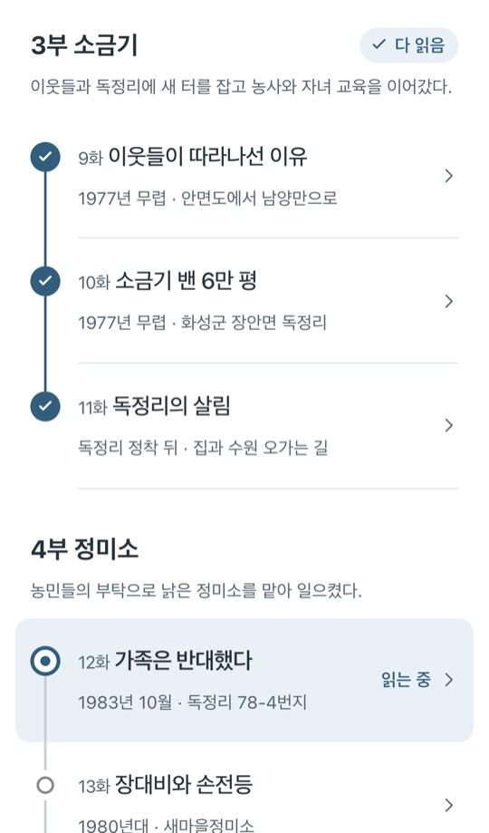

이 서비스는 Duvridge 모노레포의 `@duvridge/toldlife-audiobooks` 워크스페이스입니다. 설치는 저장소 루트에서 `npm ci`로 한 번만 합니다. 개발·빌드는 루트에서 `npm run dev --workspace @duvridge/toldlife-audiobooks`, `npm run build --workspace @duvridge/toldlife-audiobooks`로 실행합니다. 배포 정책은 [루트 README](../../README.md)를 따릅니다.

서비스 이름은 `toldlife-audiobooks`로 통일합니다. `AudiobookReaderLayout.vue`가 화면을 구성하고 `AudiobookHome.vue`가 공통 `StoryHome.vue`에 청취 상태를 연결합니다. `AudiobookPlayerBar.vue`·`AudiobookPlayerSheet.vue`는 플레이어, `NarrationStartButton.vue`는 선택한 문장부터 듣는 버튼입니다. 네이밍 기준은 [네이밍 정책](../../docs/naming-policy.md)을 따릅니다. 기본 공개 경로는 `/audiobooks/`이며 `SITE_BASE`로 별도 테스트 경로를 지정할 수 있습니다.

원고는 `packages/memoir-content/배병희_자서전.md`, 공통 자료·음악·삽화는 `packages/memoir-content/content/`와 `packages/memoir-content/site/public/`에서만 수정합니다. 앱 안의 동일 경로는 준비 단계에서 만든 무시된 작업 사본이며 다음 실행 때 교체됩니다. 공통 문체·본문·목차·기본 컴포넌트는 `packages/story-reader/`에서 관리합니다. 삭제·이름 변경한 공통 입력은 생성 목록에 따라 작업 사본에서도 제거되며, 오디오 앱의 낭독 음성·자막은 보존됩니다.

낭독 MP3/SRT와 플레이어·문장 선택·자동 재생·청취 상태는 이 앱이 소유합니다. 최신 본문은 읽기 서비스와 같고 목차는 1936 안면도, 1977 남양만 간척지, 1983 독정 정미소, 2003 독정 RPC의 터전 구분을 따릅니다.

기존 녹음은 수정 전 원고를 읽습니다. 원고에 정확히 남아 있는 문장만 강조하며 프롤로그 9/15, 1화 18/32, 2화 12/27, 3화 21/32개가 일치합니다. 특히 2화에서 삭제된 자염 장면은 기존 음성에 남아 있습니다. `packages/memoir-content/content/narration-compatibility.json`의 2화 예외는 현재 해당 회차 텍스트·MP3·SRT 해시와 일치 문장 수가 모두 같은 경우에만 적용합니다. 삽화 표시와 다른 회차·작품 소개 편집은 이 예외를 무효화하지 않습니다. 해당 회차의 실제 텍스트 변경은 기존 50% 일치 검증을 따릅니다. 완전한 본문·음성 일치는 최신 정본으로 다시 녹음해야 합니다.

  

<h1 align="center">내 논을 파는 한이 있어도</h1>

  배병희 자전소설 · 가족이 휴대폰으로 함께 읽는 서재 
  프롤로그 · 4개 터전 23화 · 에필로그 · 외전

  <a href="https://toldlife.duvridge.com/audiobooks/"><b>읽으며 듣기 →</b></a>

  <i>“내 논을 파는 한이 있어도, 농사지은 사람 볏값은 밀려선 안 된다.”</i>

 

<table align="center">
  <tr>
    <td align="center" width="33%">
       
      <b>표지</b> 다시 오면 소개를 접고 아래 막대에서 이어 듣기
    </td>
    <td align="center" width="33%">
       
      <b>회차</b> 수채화 삽화와 넉넉한 글씨
    </td>
    <td align="center" width="33%">
       
      <b>목차</b> 읽은 곳·읽는 곳·남은 곳이 한 줄에
    </td>
  </tr>
</table>

원고·목차·주소·음악·삽화는 음악 파일명과 같은 회차 ID를 사용합니다. 본편은 `ep01`~`ep23`, 소개는 `intro`, 프롤로그는 `prolog`, 에필로그는 `epilog`, 외전은 `side`입니다. 예를 들어 원고 `{#ep01}`, 주소 `/read/ep01.html`, 음악 `/music/ep01.mp3`, 반응 저장 경로 `pages/memoir-ep01`이 같은 1화를 가리킵니다.

회차 음악은 `packages/memoir-content/site/public/music/`에 두고 `packages/memoir-content/content/music.json`의 `tracks[].id`로 연결합니다. 사이트에서 배경음악으로 틀지는 않고, 오디오북 제작 도구(`tools/audiobook-production/src/assemble_audiobook.py`)가 낭독 앞뒤 음악으로 씁니다. 삽화는 `ep08-01`, `ep08-02`처럼 회차 ID에 장 번호를 붙이고 `packages/memoir-content/content/episode-illustrations.json`에서 연결합니다. 두 번째 외전부터는 `side-02`, `side-03`을 사용합니다. 원고 순서를 바꾸면 회차 ID와 관련 음악·삽화도 함께 정리해야 하며, 번호나 파일명이 어긋나면 빌드가 중단됩니다.

낭독 음성은 `site/public/record/<회차 ID>.mp3`, 문장 시각은 `content/narration/<회차 ID>.srt`에 둡니다. 홈과 회차 화면 아래에는 플레이어 막대가 하나 있습니다. 막대는 어느 상태에서나 그림, 제목과 시간, 오른쪽 버튼 하나로 같은 모양이고, 버튼 글자만 '듣기', '일시 정지', '이어 듣기'로 바뀝니다. 막대를 누르면 펼친 플레이어에서 문장 이동, 재생 속도, 다음 화 자동으로 듣기, 공유를 고릅니다.

목차의 회차나 회차 끝의 '이전 화 / 다음 화'를 누르면 그 회차로 넘어가며 바로 들려 줍니다. 링크로 처음 들어온 순간만 브라우저가 소리를 막아서 '듣기'를 한 번 눌러야 합니다. 듣는 동안에는 읽는 문장을 표시하고 화면이 따라갑니다. 화면을 직접 움직이면 따라가기를 멈추고 '지금 듣는 곳으로' 버튼을 띄우며, 아무 문장이나 누르면 그 문장부터 들을 수 있습니다. 목차로 나가도 계속 들리고, 회차 끝 음악이 끝나면 다음 화를 이어서 들려 줍니다. 잠금 화면의 앞뒤 버튼은 10초씩 옮깁니다. 녹음이 없는 회차는 목차와 막대에 '준비 중'으로 보이고 글은 읽을 수 있습니다. 오디오북 전용 서비스라 배경음악은 두지 않습니다.

새 회차는 [오디오북 제작 도구](../../tools/audiobook-production/README.md)에서 별도 제작한 뒤 `npm run narration:sync --workspace @duvridge/toldlife-audiobooks -- ep04 ep05`처럼 옮깁니다. 기본 입력은 `tools/audiobook-production/output/`이며 `--from`으로 다른 결과 폴더를 지정할 수 있습니다. 이 명령은 음성을 복사하고, 문단 안 문장의 시작 시각을 실제 낭독의 쉼에 맞춰 보정한 문장 시각 파일을 씁니다. ffmpeg가 필요하며, 원고에서 찾지 못한 문장이 있으면 옮기지 않습니다. 이미 옮긴 회차의 원고를 고쳐도 빌드는 계속되지만 고친 문장은 표시되지 않습니다. 절반 넘게 고쳤다면 빌드가 멈추니 다시 녹음해 옮기세요.

표지와 회차 첫 삽화만 화면 크기에 맞는 WebP를 사전 로딩하고, 본문 삽화는 지연 로딩합니다. 이미지 전송이 실패하면 720px JPG로 복구하며, 두 형식 모두 실패하면 다시 불러오기 버튼을 표시합니다. 삽화 위치를 옮길 때는 캐시된 페이지에서도 그림을 볼 수 있도록 이전 공개 파일 주소를 보존합니다.

본문 중간 삽화 앞에는 장면 전환 표시를 자동으로 넣고, 이미 원고에 표시가 있으면 중복하지 않습니다. 회차 첫 삽화에는 넣지 않습니다. 그 밖에는 시간·장소·사건이 크게 달라질 때만 원고에 `* * *`를 남기고, 같은 이야기의 흐름은 일반 문단 간격으로 이어갑니다.

회차 반응은 누른 즉시 선택과 숫자를 표시하고, 연속으로 누른 선택을 모아 서버에 비동기로 저장합니다. 초기 집계 조회는 버튼을 막지 않으며, 저장 대기 중인 마지막 선택은 브라우저에 보관해 다음 화 이동이나 새로고침 뒤에도 이어서 저장합니다.

콘텐츠 준비 단계에서 참고 이미지 인덱스와 참고 목록 화면의 회차 번호·제목·원고 해시도 자동 갱신합니다. 옛 제목·연대 주소는 새 번호 주소로 이동하고, 브라우저의 읽던 위치와 완독 기록도 자동 변환합니다.

운영 반응 데이터를 옮길 때는 이 앱 디렉터리에서 `node scripts/migrate-reaction-ids.mjs --project=<프로젝트 ID>`로 대상 건수를 먼저 확인한 다음 `--apply`를 붙여 실행합니다. 작성자 UID와 선택값·시각을 보존하며, 이미 옮긴 데이터보다 오래된 값은 덮어쓰지 않습니다. 기존 경로의 데이터는 보관합니다.
