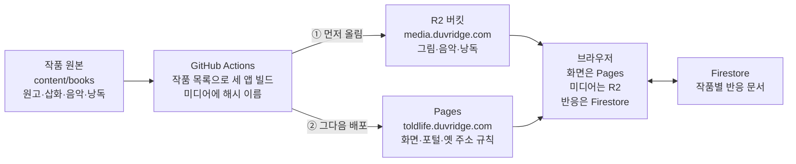
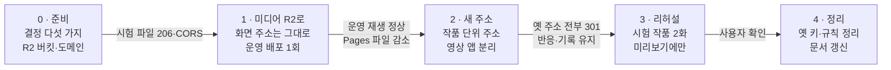

# 작품별 주소 개편 · R2 이전 작업 계획서

2026-10-09 기준

세 형식의 주소를 `/형식/{작품}/{회차}`로 바꾸고, 그림·음악·낭독 파일은 Cloudflare R2로 옮깁니다. 이미 공유된 링크와 반응, 이어 읽기 기록은 첫 작품(`bae-byunghee`)으로 그대로 이어집니다. 작업은 준비를 포함해 5단계이고, 단계마다 운영 확인을 통과해야 다음 단계로 넘어갑니다.

## 현재 작업 상황 (2026-10-09)

R2는 보류하고 주소 개편과 최신 제작본을 통합했습니다. 최신 제작본 위로 URL 개편을 통합했으며, 원격 전체 이력의 작성자·커미터를 MJbae로 통일합니다. 오디오북과 자막이 든 영상은 프롤로그·본편 23화·에필로그·외전의 26개 회차를 모두 제공합니다.

- 구현 완료: 작품별 페이지·미디어·지연 로드 카탈로그, 영상 앱 분리, 네 서비스의 완전한 Pages 조립, 포털·회사 링크, clean canonical·공유 정보·sitemap, 옛 주소 388개의 단일 301 규칙과 도착 페이지 검사
- 기존 상태 보존: 첫 작품의 반응 문서·캐시 ID 유지, 작품별 읽기·완독·이어 읽기·낭독 키 복사와 옛 키 보존, `#video` 호환
- 최신 제작본: 승인된 MP3/SRT/장면 입력 26개, 로컬 제작 MP4 26개. 각 MP3와 SRT 종료 시각의 최대 차이는 0.001초입니다. 오디오북은 MP3·자막·장면 데이터를, 영상 탭은 자막이 든 MP4를 그대로 사용합니다(사용자 결정, 2026-10-09). MP4는 Git에서 제외하고 GitHub Release에 둡니다. 25MB 이상인 8개는 Pages 파일 제한에 맞게 다시 인코딩했습니다. 배포 조립이 Release에서 받아 크기·해시를 확인하고 Pages에 함께 올립니다. R2로 옮길 때는 받는 위치만 바꿉니다.
- 검증 완료: 저장소·공통 패키지·제작 파서·세 리더 테스트/빌드/타입, 읽기·음악·낭독·영상 브라우저 회귀, 두 작품 URL 리허설 14건, 로컬 전체 리다이렉트·공개 본문 검사. 세부 결과는 `deployment-verification.md`에 기록합니다.
- 운영 반영: main 커밋·푸시 후 GitHub Actions의 검증·완전한 스냅샷 배포를 확인하고, 실제 Cloudflare의 301/도착 200과 세 형식 재생을 검증합니다.
- 범위: R2 버킷·도메인·토큰·업로드·CORS·캐시는 변경하지 않습니다. 낭독 제어와 큐 상호작용은 각 앱이 소유합니다. 웹 빌드에서 음성·SRT·영상은 생성하지 않습니다.

## 바뀌는 주소

새 주소에는 `.html`이 붙지 않습니다. 옛 주소는 모두 새 주소로 한 번에 영구 이동(301)합니다.

| 화면 | 지금 | 바뀐 뒤 | 지금 주소로 들어오면 |
| --- | --- | --- | --- |
| 소설 작품 홈 | `/novels/` | `/novels/bae-byunghee/` | 포털의 오리지널 시리즈 탭 (형식 첫 주소가 됨) |
| 소설 회차 | `/novels/read/ep01.html` | `/novels/bae-byunghee/ep01` | 새 주소로 301 |
| 오디오북 작품 홈 | `/audiobooks/` | `/audiobooks/bae-byunghee/` | 포털의 오디오북 탭 (형식 첫 주소가 됨) |
| 오디오북 회차 | `/audiobooks/read/ep01.html` | `/audiobooks/bae-byunghee/ep01` | 새 주소로 301 |
| 영상 작품 홈 | `/audiobooks/watch/` | `/videos/bae-byunghee/` | 새 주소로 301 |
| 영상 회차 | `/audiobooks/watch/prolog.html` | `/videos/bae-byunghee/prolog` | 새 주소로 301 |
| 옛 회차 이름 | `/novels/read/1930s.html` 등, 앱마다 37개 | 없음 | 안내 페이지 대신 해당 회차로 바로 301 |
| 형식 첫 주소 | 없음 | `/novels/` · `/audiobooks/` · `/videos/` | 포털의 해당 탭으로 이동 |
| 포털 | `/` | `/` | 그대로. 작품 목록만 자동으로 만듦 |

현재 옛 주소와 형식 첫 주소의 정적 규칙은 388개입니다. Pages 리다이렉트 한도(정적 2,000개) 안에 들고, 새 작품에는 옛 주소가 없어 더 늘지 않습니다.

## 구조

미디어를 먼저 R2에 올린 뒤 Pages를 배포합니다. 브라우저는 화면을 Pages에서, 그림·음악·낭독을 R2에서 받고, 반응은 지금처럼 Firestore에 남깁니다.

## 작업 단계 한눈에

운영 배포는 1단계와 2단계에서 한 번씩 크게 일어납니다. 3단계의 시험 작품은 미리보기 주소에만 올립니다.

## 단계별 작업

R2를 먼저 옮깁니다. 미디어 주소가 화면 주소와 분리되면 2단계에서는 화면 주소만 바꾸면 됩니다.

1. **0단계 · 준비**
    - 아래 '시작 전에 정할 것'을 확정합니다.
    - 진행 중인 녹음 교체 작업(프롤로그 재녹음, 1~3화 녹음 삭제)이 main에 반영된 뒤 시작합니다.
    - R2 버킷 `toldlife-media`를 만들고 `media.duvridge.com`을 연결합니다. CORS, 캐시 규칙, GitHub Actions용 R2 토큰도 준비합니다.
    - 통과 조건: 시험 파일이 Range 요청에 206, Origin이 있는 요청에 CORS 헤더로 응답합니다.
2. **1단계 · 미디어를 R2로 (화면 주소는 그대로)**
    - 빌드가 미디어 목록을 만들고, 파일 이름에 내용 해시를 붙입니다.
    - 배포 순서를 'R2에 없는 파일만 업로드 → Pages 배포'로 바꿉니다. 업로드가 실패하면 Pages 배포를 하지 않습니다.
    - 소설·오디오북 화면, 포털, 회사 사이트의 표지가 R2 주소를 씁니다. 회사 사이트는 지금 `/novels/images/home-cover-*`를 직접 가져다 씁니다.
    - Pages 묶음에서 그림·음악·낭독 파일을 뺍니다. 로컬 개발과 테스트는 지금처럼 로컬 파일을 씁니다.
    - 통과 조건: 운영에서 그림, 배경음악(12% 음량), 낭독 재생과 건너뛰기가 정상입니다. Pages 파일은 약 1,110개에서 약 440개로 줄어듭니다.
3. **2단계 · 작품 단위 구조와 새 주소**
    - `content/books/*/book.json`을 모아 작품 목록을 만듭니다. 서비스 등록부(`service-registry.json`)는 책 하나 대신 이 목록을 씁니다.
    - 소설·오디오북 앱이 작품마다 `/{작품}/`와 `/{작품}/{회차}` 페이지를 만듭니다. 작품 정보(한 작품에 약 81KB)는 작품별 파일로 나눠, 페이지가 자기 작품 것만 불러옵니다.
    - 영상을 새 앱 `apps/toldlife-videos`(기준 경로 `/videos/`)로 분리합니다. 저장소 지침에 따라 낭독 제어와 큐 상호작용은 각 앱에 두고, 공통 화면과 작품 카탈로그 주입만 기존 기능별 패키지에서 공유합니다.
    - 포털을 작품 목록에서 자동으로 만듭니다. 영상 탭 주소는 `#video`에서 `#videos`로 바꾸고, 옛 주소도 동작하게 둡니다.
    - 작품 목록에서 `_redirects`를 만들어 옛 주소를 301로 보냅니다. canonical, 공유 정보, sitemap도 새 주소로 바꿉니다.
    - 반응과 기록은 아래 '기존 기록 보존'대로 옮깁니다.
    - 통과 조건: 옛 주소 전체가 한 번에 새 주소로 갑니다. 첫 작품의 반응 수가 그대로이고, 옛 기록이 있는 브라우저에서 이어 읽기가 이어집니다.
4. **3단계 · 두 번째 작품 리허설 (미리보기 배포만)**
    - 회차 2개짜리 시험 작품을 미리보기 배포에만 올립니다.
    - 포털 목록, 세 형식의 주소, 작품 간 반응·기록 분리, 미디어 경로를 확인합니다.
    - 통과 조건: 사용자 확인.
5. **4단계 · 정리**
    - 2단계에서 남겨 둔 옛 기록 키와 옛 안내 페이지 코드를 지웁니다.
    - README, 이름 규칙 문서, 배포 기록을 새 구조로 고칩니다.
    - 쓰이지 않는 R2 파일의 정리 기준을 정합니다. 지난 배포로 되돌릴 수 있는 동안은 보관합니다.

## R2 미디어 설계

미디어는 버킷 하나(`toldlife-media`)에 작품별 폴더로 두고, `media.duvridge.com`으로 내보냅니다. Cloudflare는 r2.dev 주소를 운영용이 아니라고 안내하므로 쓰지 않습니다.

- **파일 위치:** `works/{작품}/images/`, `works/{작품}/music/`, `works/{작품}/narration/`
- **파일 이름:** 내용 해시를 붙입니다(예: `ep01-01.3f9a2c1b-720.webp`). 다시 녹음하면 이름이 바뀌므로 오래된 캐시가 남지 않습니다.
- **캐시:** `Cache-Control: public, max-age=31536000, immutable`을 붙입니다. 사용자 도메인은 기본으로 일부 파일 형식만 캐시하므로, 캐시 규칙을 따로 겁니다.
- **CORS:** GET·HEAD를 허용합니다. 배경음악은 Web Audio로 음량을 12%로 줄이는데(`background-music.ts`), 다른 주소의 음원은 CORS가 없으면 소리가 나지 않습니다. 미리보기 주소가 배포마다 달라 허용 출처는 `*`로 둡니다(공개 파일).
- **업로드:** GitHub Actions가 R2에 없는 파일만 올린 뒤 Pages를 배포합니다. 배포할 때 R2 파일은 지우지 않아, 지난 배포로 되돌려도 미디어가 남아 있습니다.
- **용량과 비용:** 한 작품의 미디어는 영상을 빼면 약 158MB입니다(그림 33MB, 음악 111MB, 낭독 14MB). 영상 MP4 26개가 약 487MB를 더해 작품당 약 645MB입니다. 지금은 두 앱에 그림과 음악이 한 벌씩 들어가 배포가 약 327MB에 영상이 더해집니다. R2 무료 범위(월 10GB 저장)에 영상까지 약 15작품이 들어가고, 내려받기 요금은 없습니다. 넘으면 GB당 월 $0.015입니다.
- **Pages 파일 한도:** 미디어를 빼면 화면 파일은 약 440개입니다. 작품마다 회차 페이지와 스크립트가 약 250개씩 늘어, 무료 한도 20,000개에는 약 80작품에서 닿습니다(추정).

## 기존 기록 보존

반응은 옮기지 않고, 브라우저 기록은 첫 방문 때 첫 작품 이름으로 복사합니다. 옛 키는 4단계까지 남겨, 지난 배포로 되돌려도 기록이 살아 있게 합니다.

| 데이터 | 지금 | 바뀐 뒤 | 옮기는 방법 |
| --- | --- | --- | --- |
| 반응(Firestore) | `pages/memoir-ep01` | 첫 작품은 그대로, 새 작품은 `pages/{작품}-ep01` | 옮기지 않음. 보안 규칙의 ID 형식(영문·숫자·`-`·`_`, 120자 이내)에 맞아 규칙 배포도 필요 없음 |
| 반응 표시 캐시 | `family-library:reaction:ep01` | 첫 작품은 그대로, 새 작품은 `…:reaction:{작품}-ep01` | 옮기지 않음 |
| 이어 읽기·다 읽은 회차 | `family-library:reading`, `:resume`, `:completed` | `family-library:{작품}:reading` 등 | 첫 방문 때 첫 작품 키로 복사 |
| 낭독 위치(오디오북·영상 공유) | `family-library:narration` | `family-library:{작품}:narration` | 첫 방문 때 첫 작품 키로 복사 |
| 설정 | 글자 크기, 종이·밤, 배경음악, 재생 속도, 자동 재생, 자막, 홈 탭 | 그대로(모든 작품 공통) | 없음 |

## 검증과 위험

새 코드는 테스트를 먼저 씁니다. 단계마다 로컬 검사, CI, 운영 확인을 모두 통과해야 다음 단계로 갑니다.

- **단위 검사:** 작품 목록 생성, 리다이렉트 생성(옛 주소마다 실제로 있는 새 페이지로 가는지), 기록 복사, 미디어 목록(화면이 쓰는 파일이 모두 R2 목록에 있는지)
- **브라우저 검사:** 지금의 세 형식 시나리오에 시험 작품을 더해 작품 간 분리를 봅니다. 다른 주소에서 음원을 내는 로컬 서버로 배경음악 CORS를 재현합니다.
- **운영 확인:** 옛 주소 전체의 301과 도착 주소, R2의 206·CORS·캐시 헤더, 세 형식의 재생을 확인하고 배포 기록에 남깁니다.

| 위험 | 영향 | 대응 |
| --- | --- | --- |
| R2 음원에 CORS가 빠짐 | 소설 배경음악이 소리 없이 재생 | CORS 정책과 `crossorigin`, 교차 출처 브라우저 검사(1단계 통과 조건) |
| 옛 주소 누락 | 공유 링크와 검색 결과가 404 | 작품 목록에서 규칙을 자동 생성하고 운영에서 전부 확인 |
| 기록 복사 실패 | 이어 읽기와 낭독 위치가 처음으로 돌아감 | 옛 기록을 심은 브라우저 검사, 옛 키 보존 |
| 미디어보다 화면이 먼저 배포됨 | 새 화면이 없는 파일을 가리킴 | R2 업로드가 성공해야만 Pages 배포 |
| 녹음 교체 작업과 같은 파일 수정 | 충돌, 검토 중인 변경이 섞임 | 그 작업이 반영된 뒤 시작 |
| Pages 파일 한도 | 약 80작품 뒤 배포 실패 | 조립 스크립트가 20,000개 초과를 이미 막음. 그 전에 유료 전환이나 프로젝트 분리를 결정 |

## 시작 전에 정할 것

아래 다섯 가지가 정해지면 0단계를 시작합니다. 각 항목의 내용은 추천안입니다.

- [x] 작품 주소 이름: 책 ID를 그대로 써서 `bae-byunghee`. 한 번 정하면 바꾸지 않습니다.
- [ ] 미디어 주소: `media.duvridge.com`
- [x] 형식 첫 주소(`/novels/` 등): 포털의 해당 탭으로 이동. 형식별 목록 화면은 따로 만들지 않습니다.
- [ ] R2 사용 시작과 R2 토큰 발급: Cloudflare 계정 화면에서 해 주시거나, 권한을 주시면 제가 합니다. 토큰은 GitHub 비밀값으로 등록합니다.
- [x] 녹음 교체 작업과 전체 26회차 제작본 main 반영(`1a26809`)

## 출처

모두 2026-10-09에 확인한 Cloudflare 문서입니다.

- [R2 요금](https://developers.cloudflare.com/r2/pricing/): 무료 범위(월 10GB 저장, 쓰기 100만 회, 읽기 1,000만 회), 내려받기 무료, 초과 시 GB당 월 $0.015
- [R2 공개 버킷과 사용자 도메인](https://developers.cloudflare.com/r2/buckets/public-buckets/): 같은 계정의 도메인만 연결, r2.dev는 운영용 아님, 캐시 설정
- [R2 CORS](https://developers.cloudflare.com/r2/buckets/cors/): 정책 설정 방법, 바꾼 뒤 캐시 비우기
- [Pages 한도](https://developers.cloudflare.com/pages/platform/limits/): 무료 20,000개·유료 100,000개 파일, 파일당 25MiB
- [Pages 리다이렉트](https://developers.cloudflare.com/pages/configuration/redirects/): 정적 2,000개·동적 100개, 파일보다 먼저 적용
- [Pages 주소 처리](https://developers.cloudflare.com/pages/configuration/serving-pages/): `.html`을 뗀 주소로 자동 이동
